# Web walkthrough

Every page of the app, walked against the running stack: the compose deployment on
`http://127.0.0.1:8099`, with two accounts, and one real end-to-end run submitted to Vertex AI.

Run the stack as `docs/DEPLOYMENT.md` describes. The accounts used below are throwaway local
ones; their passwords are deliberately not reproduced here, and the recovery code visible in
screenshot 04 belongs to an account whose password was changed afterwards, which rotates the code
and makes the one shown dead.

**One screenshot is edited.** In `12-models-and-health.jpg` the Cloud Storage bucket path is
replaced with `gs://<your-bucket>/model_weights`, so this document names no real infrastructure.
Nothing else is altered.

---

## 1. Signed out

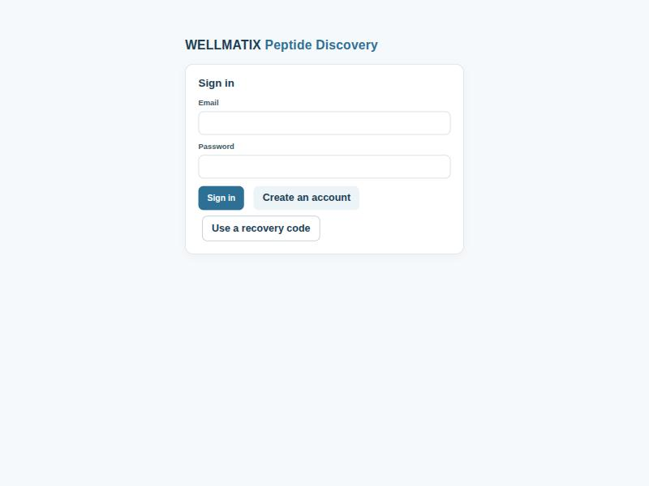

Any path reaches this page while signed out; the app decides what a signed-out visitor may see,
and the proxy decides what anyone may call.

## 2. A refused sign-in

**Input:** an email that does not exist, with any password.

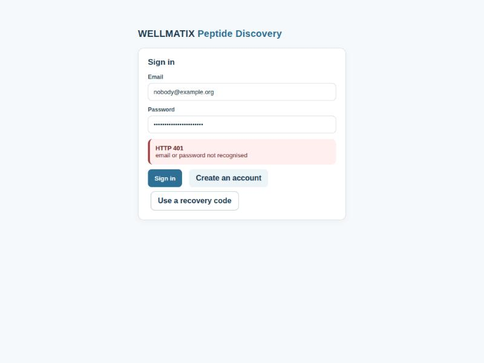

**Expected:** `HTTP 401 — email or password not recognised`, and nothing more. A wrong password on
an account that *does* exist gives the identical message, and the server spends the same work
either way. Two different answers, or two different response times, would turn this form into an
account-enumeration oracle.

The user is **not** signed out or redirected — a 401 here is a refused credential, not a dead
session.

## 3. Registering

**Input:** an email, a password of at least 12 characters, and the captcha.

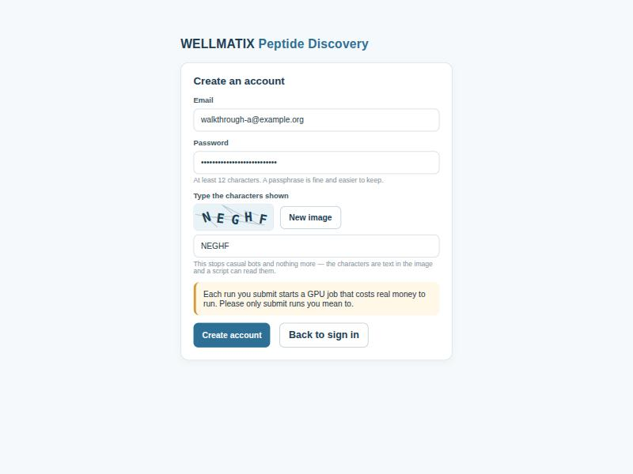

**Expected:** the captcha renders as an ``, never as injected
markup, so its SVG cannot execute anything. The cost warning is shown before the account exists,
not after.

The captcha stops casual bots and nothing more. During this walkthrough it was solved repeatedly
by reading the SVG's `<text>` nodes in one line of JavaScript — the same thing
`services/accounts/tests/conftest.py` does. The page says so in its own hint.

## 4. The recovery code

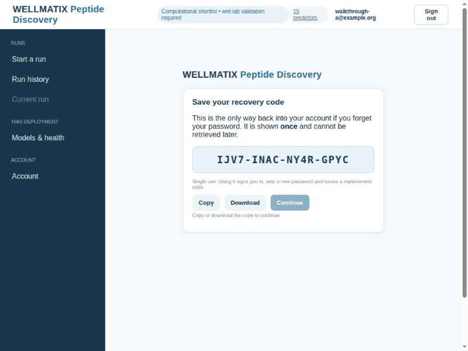

**Expected:** the code is shown **once**, and **Continue is disabled** until it has been copied or
downloaded — the greyed button and the line "Copy or download the code to continue." Leaving the
page before then warns.

**Verified:** after pressing Copy the button enables and the hint disappears; pressing Continue
lands in the app, signed in. Registration signs in *before* navigating, so reloading this screen
cannot strand you on a page whose code is gone.

## 5. Starting a run — validation

**Input:** press "Submit this run" with nothing chosen.

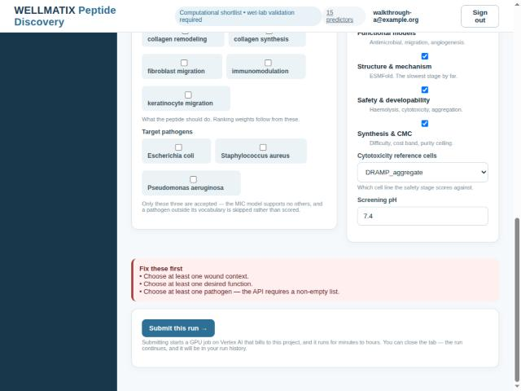

**Expected:** every problem at once, and **no request sent**:

- Choose at least one wound context.
- Choose at least one desired function.
- Choose at least one pathogen — the API requires a non-empty list.

Both submit paths — the form and the JSON tab — run the same checks.

## 6. Starting a run — the form

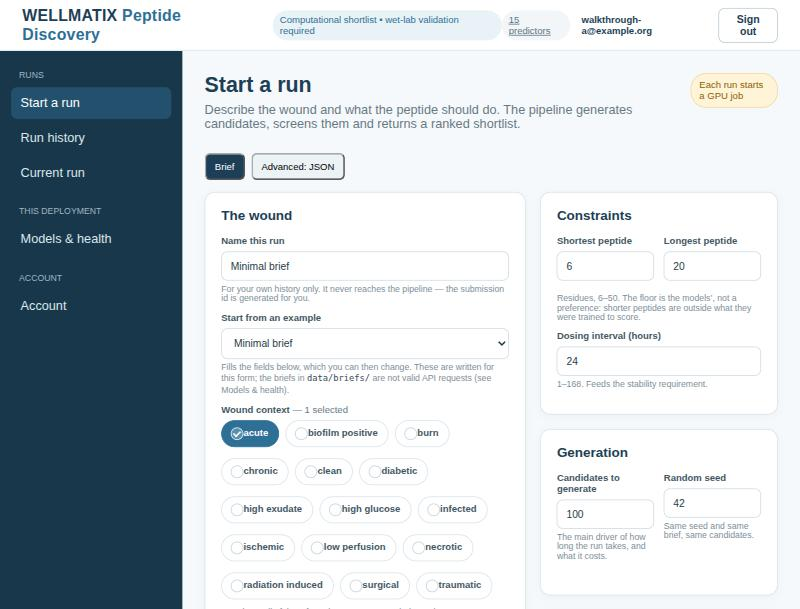

Every option and bound comes from `web/openapi/peptide.json`, the snapshot taken from `api.py`
itself, so the form cannot offer something the API would reject. The hints say where the limits
come from: peptide length is 6–50 because that is what the models were trained to score, and only
three pathogens are accepted because the MIC model supports no others.

"Start from an example" offers five briefs written for this form. The 32 briefs in `data/briefs/`
are **not** offered, because none of them is a valid API request — see `docs/BRIEF_VALIDITY.md`.

## 7. Starting a run — Advanced: JSON

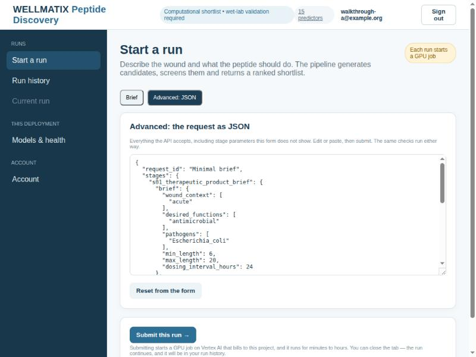

The whole request, editable, including stage parameters the form does not show. `request_id` is
whatever you typed; the proxy replaces it with `u<account id>:<uuid>` before it reaches the API,
because `api.py` interpolates that value into a Cloud Storage path without normalising it.

## 8. A submitted run

**Input:** the Minimal brief with **10 candidates** instead of 100.

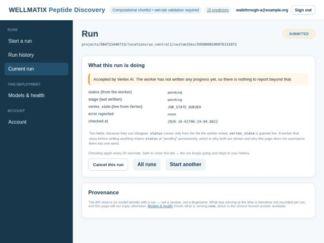

**Expected:** a real Vertex Custom Job is created and the app navigates to its page.

Note what this page refuses to do. `status` and `stage` both read `pending` while `vertex_state`
reads `JOB_STATE_QUEUED`, and the page shows **all three** rather than summarising them into one
word. The explanation underneath says why: `status` comes only from the file the worker writes, so
a worker that stops before writing anything leaves it at `pending` permanently.

The Provenance card states plainly that the API returns no model identity with a run, so what was
serving cannot be recovered from a stored result.

## 8b. The same run, finished

The run was watched to completion. It took **53 minutes** for the minimal brief on a T4, and the
page polls every 20 seconds without needing the tab to stay open.

| Stage | Reached |
|---|---|
| queued | 15:19 |
| initializing | 15:31 |
| `s04_candidate_generation` | 15:31 |
| `s05_physchem_screening` | 15:37 |
| `s06_functional_models` | 15:38 |
| `s07_structure_mechanism` | 15:42 |
| `s08_safety_developability` | 16:04 |
| succeeded | 16:12 |

Two things that matter: **12 minutes of that was queueing** before a GPU was allocated, and
**`s07_structure_mechanism` took 22 of the remaining 41** — ESMFold dominates, and it scales with
candidate count. Anyone sizing a run should start there.

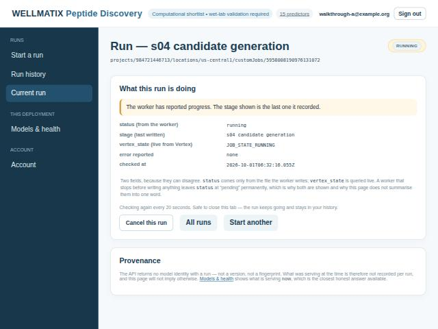

While running, the title names the stage, all three fields are shown, and **Cancel this run** is
offered.

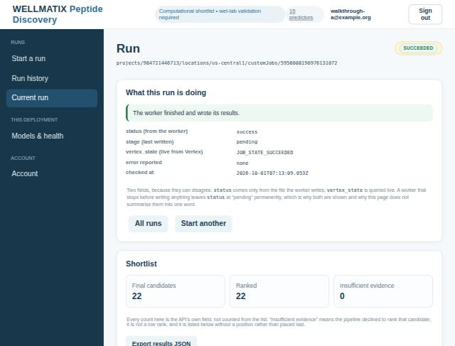

**Expected on success:** the Cancel button is gone, the state reads `SUCCEEDED`, and the counts are
the API's own fields — 22 final candidates, 22 ranked, 0 insufficient evidence. (10 was the
*generation* parameter; both routes generate, so the final shortlist is larger.)

**`stage` reads `pending` on a succeeded run.** That is not a display bug — it is what the API
returns, and it confirms from a live run what the captured fixtures showed
(`web/src/test/fixtures/README.md`). The field is only meaningful mid-run.

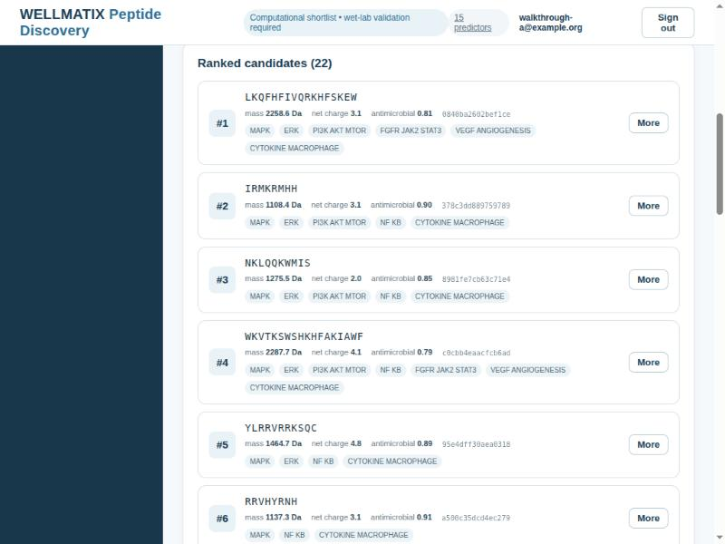

Real output: ranked peptide sequences with molecular weight, net charge and the pathways the
mechanism stage found engaged.

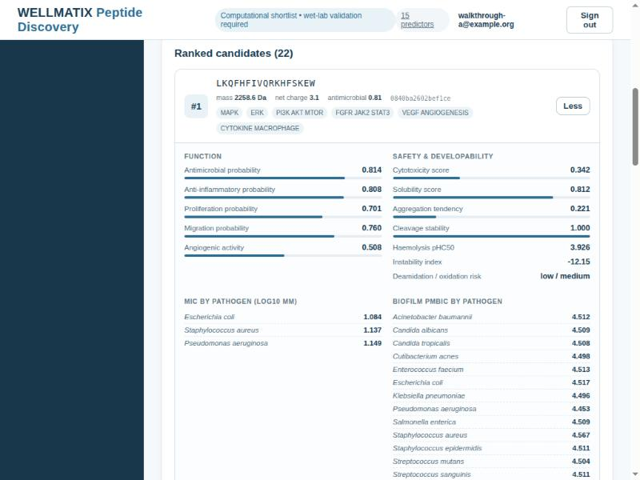

Expanding a candidate shows every score the API returned, grouped and labelled with where it came
from. Note the two per-pathogen blocks: **MIC covers the 3 species a brief may request, while
pMBIC returns 13** — including *Candida albicans* and *Acinetobacter baumannii*, which the request
schema refuses to accept as input. That is the contradiction in `docs/BRIEF_VALIDITY.md`, visible
in a live result.

## 9. Run history — empty

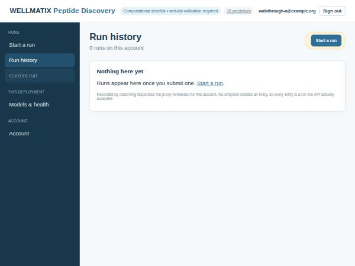

**Expected:** "Runs appear here once you submit one", and the note that entries are recorded by
observing responses the proxy forwarded — no endpoint creates one, so every entry is a run the API
actually accepted.

## 10. Run history — with a run

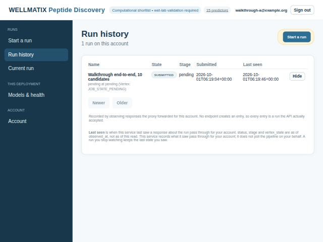

**Expected:** the run's **name** is the text typed into the form; it is stored only in the accounts
database and never reaches the pipeline. **Last seen** is `observed_at`, and the note explains the
staleness contract: this service records what it saw pass through for your account and does not
poll on your behalf, so a run you stop watching keeps the last state you saw.

"Hide" removes only the history entry. The confirmation says the run's files in Cloud Storage are
not deleted, because this app cannot delete them.

## 11. Models & health

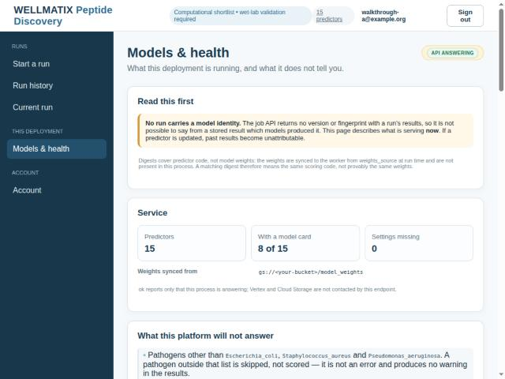

**Expected:** "No run carries a model identity" stated first, before any numbers. 15 predictors,
**8 of 15** with a model card, and settings missing **0** against a fully configured API.

The caveat under it is the API's own: the digests cover predictor *code*, not weights — the
weights are synced to the worker at run time and are not present in the API process, so a matching
digest means the same scoring code, not provably the same weights.

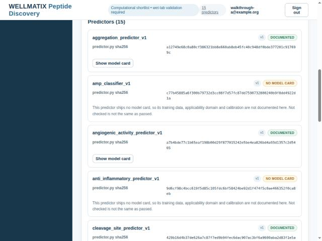

Each predictor shows its version and a sha256 of its `predictor.py`, and whether its model card
is real or a placeholder. The eight placeholders are labelled *card is a placeholder* and say so:
*"The card for this predictor is a placeholder: it records that the training data, features and
applicability domain are not yet written down... Treat this predictor's numbers as
undocumented."* The screenshot below predates that change and shows the earlier *no model card*
wording.

## 12. Account

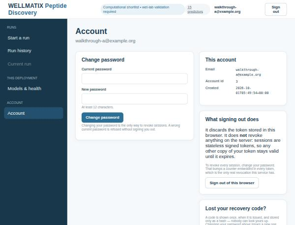

**Expected:** "What signing out does" is honest — it discards the token in this browser and revokes
nothing on the server, because sessions are stateless signed tokens. Changing the password is the
only real revocation.

A wrong current password answers **403, not 401**, so a typo does not sign you out mid-task.

## 13. Privacy — a second account

**Input:** register a second account, sign in, and open the first account's run URL directly.

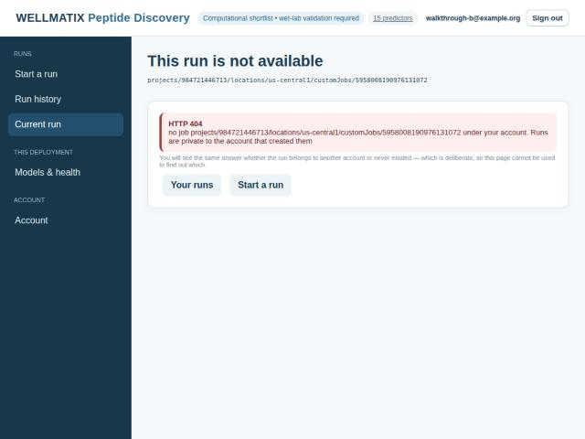

**Expected:** account B's run history is empty, and opening account A's run gives:

> **HTTP 404** — no job … under your account. Runs are private to the account that created them

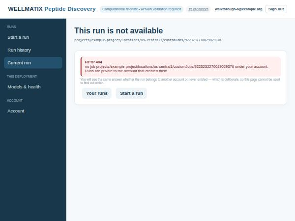

The page says the run is not available and **invents no run state**. The answer is deliberately
identical whether the run belongs to another account or never existed, so the page cannot be used
to find out which.

---

## What this walkthrough found

Four defects, none of which showed up in the test suite, and all of which came from using the app
rather than reading it. Each is fixed, with a test that fails if it returns.

**A run that is not yours rendered as a run in progress.** `RunView` only had an early return for
"no status and no error", so a 404 from the ownership check fell through to the normal render with
the default state `submitted` — producing "Accepted by Vertex AI", a **Cancel this run** button and
"Checking again every 20 seconds" for a run the viewer could not see and which might not exist.

**A second account could read the first account's job id.** The "Current run" link is per *tab*,
not per account, so signing in as another account in the same tab inherited the previous one's
link — and its `href` carried that account's job id. Opening it was refused, so no run data
leaked, but the id should not have been readable. The remembered run is now cleared on every
sign-in, sign-out and session expiry.

**The account page wrapped one character per line.** At 1024px the design system's `.kv` left 44px
for the value, so an email rendered 85px tall. The source's `.kv` assumes a full-width card; inside
the two-column grid it does not fit.

**The credentials recipe in `docs/DEPLOYMENT.md` did not work.** A bind-mounted key keeps the
host's ownership, so the file `gcloud` writes — mode 0600, owned by the host user — is unreadable
by the API container's uid 10001, and every call that touches Google answers 500 with nothing
explaining why.

## A fifth defect, found by looking at the screenshots

The selection controls and the result cards were rebuilt after this walkthrough, because the
screenshots made plain what the code did not.

**The design system was styling checkboxes as text inputs.** Its `.field input` rule sets
`width:100%`, padding, a border and a white background, and it does not exclude
`input[type="checkbox"]`. Every checkbox therefore rendered as a full-width box floating above its
own label — which is why the Stages list looked like a column of stray ticks and the multi-selects
like boxes with text beside them. That is a bug, not a matter of taste, and it was invisible in
the markup.

With it fixed, the controls were rebuilt as components rather than left as bare inputs:

- **Wound context, desired functions and pathogens** are selectable pills carrying a check when
  chosen, with a count beside the legend. The native checkbox is still there for keyboard and
  screen-reader use; it is hidden visually, not removed, and has a focus ring.
- **Stages** are switches with the stage name and what turning it off costs on one row, dimmed
  when off.
- **Candidates** lead with the rank and the sequence. Expanded, they are four scannable columns.

**The bars follow the same rule as the numbers.** A bar is drawn only where the API's value is on
a range the API itself defines — the 0-to-1 scores. Haemolysis pHC50 and the instability index get
the number and no bar, because their range is not stated and a bar implies a scale. Inventing one
would misrepresent the score as surely as rounding it would.

## Open question raised by the live run

The run was submitted to a **T4** (`n1-standard-8` / `NVIDIA_TESLA_T4`), because that is what
`.env` specifies. `README.md` says the opposite — that this deployment configures `NVIDIA_L4` /
`g2-standard-4` specifically because `routeb_protgpt2_lora_v1` loads its base model 4-bit via
`bitsandbytes`, which needs an Ampere-or-newer GPU and **can silently fall back to CPU on a T4
rather than raise**.

The API forwarded exactly what it was configured with, so this is not a bug in the code. But the
README and the deployment disagree about something that silently changes what the pipeline
produces, and one of the two is wrong. Parked for the backend owner.

**The run succeeded on the T4 regardless**, producing 22 ranked candidates. So whatever Route B
did, it did not fail loudly — which is exactly the behaviour the README warns about, and the
reason this is worth settling rather than leaving to chance. Nothing in the API's output says
which route produced which candidate, so the UI cannot tell you either.
